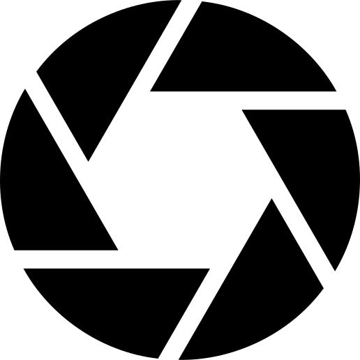
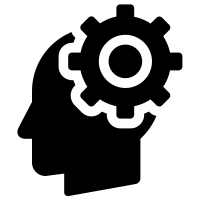
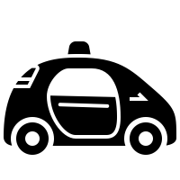

<section class="wrapper"> 
   
  <h2>Polymath <i>vs.</i> Philomath</h2>
     
    
After a career as <strong>an Applied Physicist</strong> working on Advanced Magnetic Memory Technology (Bit Patterned Media, Templated Growth PMR, Orthogonal ST-RAM), I wanted to try something else, get out of my comfort zone and challenge myself. The turning point was Andrew Ng's class on Machine Learning: my very first MOOC class!! What an eye-opening experience!. I followed with the Udacity Nanodegree, the Self Driving Car Nanodegree, the AI ND...   

    I enjoy learning and keeping up-to-date wit hcurrent tenchology: apply machine learning to a variety of data modalities: housing statistics, images. I am also interested in Self-Driving Cars: I am building a Autonomous model RC car: <i>Sonic</i>.

    
    
    
</section>
        
          
    